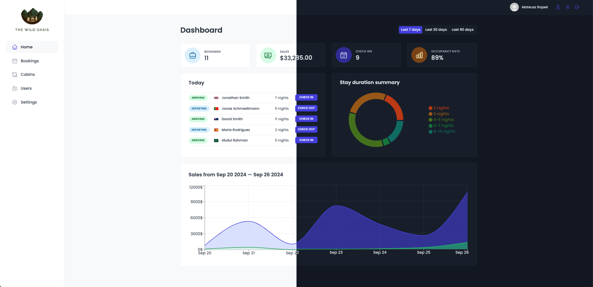

# The Wild Oasis

Welcome to The Wild Oasis! This is a hotel management web app, where hotel employees can manage cabins, bookings, and guests. It uses Supabase as the backend and implements advanced React techniques such as HOCs and React Query.

# Live Site

Check out the live admin app here: [The Wild Oasis - Admin]()

# Customer Version

I also built a customer version of this app, where guests can view and book cabins, manage their bookings, and update their profiles. The repository is [here](https://github.com/M3fjuLeo/The-wild-oasis-v2), and the live site is [here](https://the-wild-oasis-v2-mu.vercel.app/).

# Key Feautures

- User authentication ensures that only hotel employees can access the system.
- Employees can manage their profiles, including uploading avatars and changing passwords.
- The app features a dashboard showing recent stats on bookings, check-ins, and sales.
- Manage cabins with the ability to create, update, or delete cabin records.
- Handle bookings with the ability to check guests in and out, and update booking statuses.
- Real-time updates for cabins and bookings using Supabase.
- Visual statistics with charts displaying sales, occupancy rates, and other important data.
- Fully functional dark mode for a customized user experience.

# Technologies Used

- React for the frontend.
- Supabase for the database and real-time data updates.
- React Query for data fetching and caching.
- React Router for navigation.
- React Hook Form for efficient form handling.
- Recharts for data visualization (charts and stats).
- Styled Components for styling the UI, including dark mode.
- Vite for development environment and build system.

# What I Learned

This project was a deep dive into several advanced React concepts, including:

- Authentication and Authorization: Implementing Supabase to securely manage user roles (hotel employees).
- Real-time Functionality: Leveraging Supabase's real-time features for dynamic data updates.
- State Management and Data Fetching: Using React Query to efficiently manage the app's data flow.
- Complex UI Patterns: Implementing reusable patterns like the Compound Component Pattern and Higher-Order Components (HOC) to create more maintainable and scalable code.
- Responsive and Adaptive Design: Building a responsive user interface using Styled Components, making sure it works well on different devices and screen sizes.
- Dark Mode: Adding dark mode functionality for a personalized user experience.
- Data Visualization: Using Recharts to create meaningful visual representations of hotel statistics.
